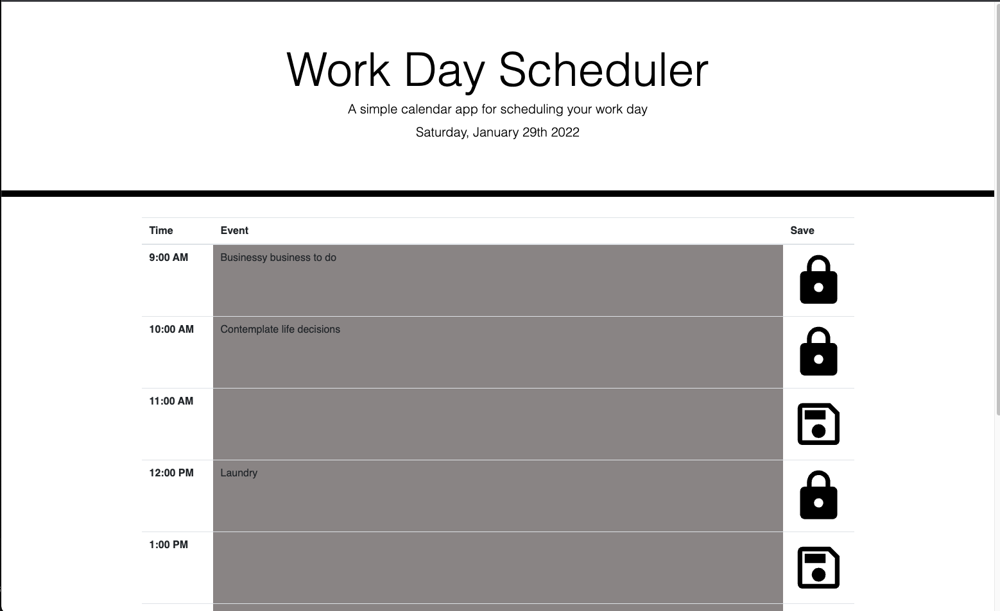

# du-planner-proj-5

DU project to create daily planner 

## Design 

This application leverages the following:
- Bootstrap to handle HTML components including the module and toast
- jQuery is leveraged as a JS library to handle DOM updates
- Global variables were avoided to better memory performance 
- Content security policy to increase security posture 
- Modal and toast to handle input and confirmation
- Local storage to hold state 

Live URL:

[Daily Planner](https://anon123123123.github.io/du-planner-proj-5/)

The application will update classes using a color scheme to indicate whether the event is current past or future. 

